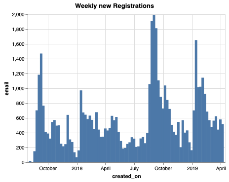
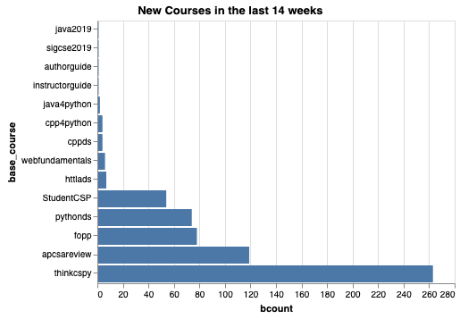
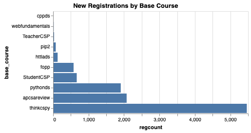
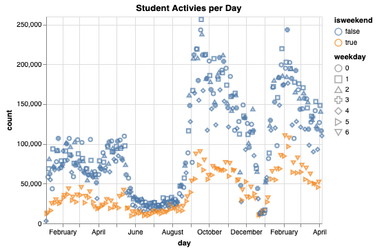

Runestone Dashboard
===================

.. author:: default
.. categories:: Dashboard
.. tags:: none
.. comments::

I've recently started working on a Runestone Dashboard to monitor our progress in terms of the number of students, and traffic, bandwidth, new courses that are created etc. I thought that it would be interesting to share a few of the graphs with you.

We launched Runestone.academy in September of 2017 so we are closing in on the end of our second academic year.  After 5 years on our old hosting service it was time for a fresh start.  This first graph shows you the number of students that have registered each week since we started.

You can clearly see the beginning of semester registration peaks, and of course its exciting to see the year over year growth.  Its interesting to note that fall registrations tend to be larger than spring registrations, but that may be because many students register for a course that continues in the spring so there is no need to re-register.

With the number of new courses in our `library </pages/library.html>`_ growing, I was really interested to see what courses people are using the most.  This is not necessarily a fair comparison as thinkcspy has been around the longest and is a very popular book in its own right.  But its really fun to see how quickly the Foundations of Python Programming book has taken off, since that was just launched in the fall of 2018.  The APCS A Review book continues to be a very valuable resource for many schools.  This graph is showing only the courses built in the last 14 weeks so it should be a pretty good indicator of what is happening Spring semester of 2019.

Not surprisingly, the number of students registering by base course has the same shape as the previous graph.  But this does count students that are studying the material as part of a formal course, as well as independent learners that just sign up for one of the open textbooks that anyone can learn from.

Finally, many people ask about the daily traffic.  There are many ways of thinking about this, from the number of unique students each day to the number of pages served each day to the number of student activities per day.  this graph shows just the count of student activities each day for the last 14 months.

Its pretty interesting to note our "summer lull" which definitely shows that we are getting most of our use during the school year.  No surprise there.  Its also amazing to see how much our traffic has grown from Spring semester 2018 to Spring semester 2019.  Finally, you can see the orange colored days are the weekends.  Is this definitive proof that our students don't study as much as we would like on the weekends!?