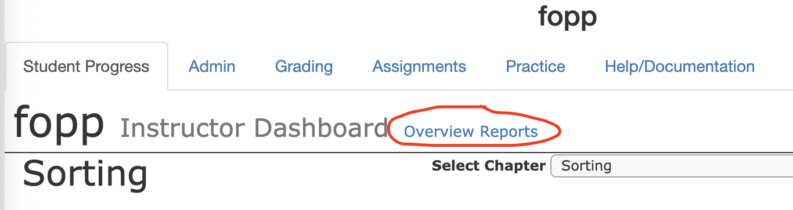
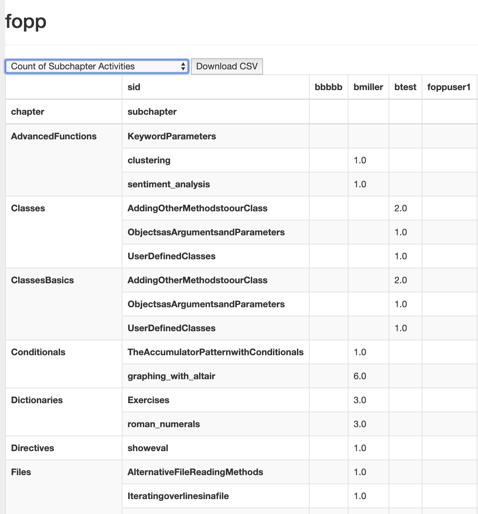
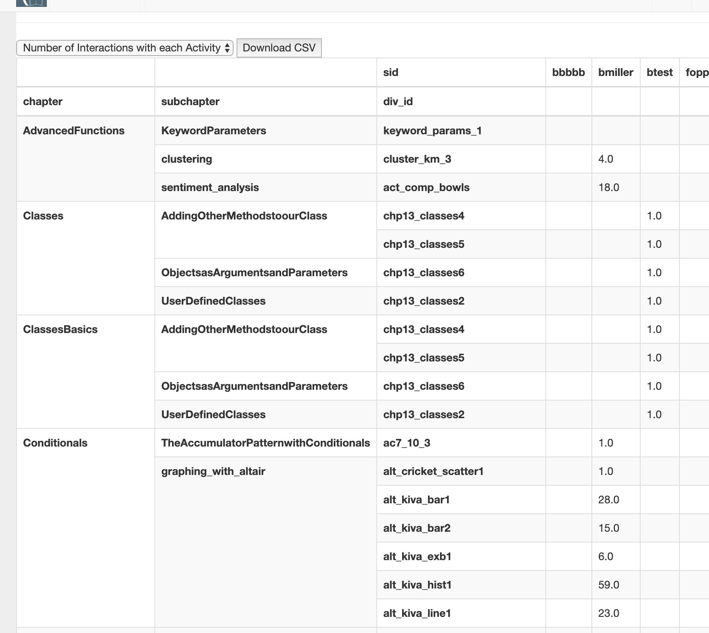

New Feature Friday
==================

Yes I'm posting this on Monday, but Friday sounded like a better title.  Many instructors have asked for the ability to download student data to import into a spreadsheet.  This was a feature we removed a couple years back because downloading the raw stream of click information really wasn't that useful, and we take data security of student information very seriously.

So, this weekend I pushed a new release of the Runestone server that gives you four new reports that you can either view online or download as a CSV file to import into your favorite spreadsheet program.

    Click on the Overview Reports link to access

The four new reports are:

* Count of Subchapter Activities
* First Interaction with all Activities
* Last Interaction with all Activities
* Number of interactions with each Activity

The count of subchapter activities is a good cross check on reading assignments.  If a student wants to know why they are not getting full credit, this report will show you how many distinct activities in each subchapter a student has attempted.

    Count of unique components a student has interacted with.

As you can see, this report is organized by Chapter and then Subchapter.  And then one column for each student.   So you can see that btest has been looking at the Classes and ClassesBasics chapters, but hasn't done any of the work in the AdvancedFunctions chapter.  Meanwhile, bmiller has been busy with Conditionals and Dictionaries.
Yes, sorting by chapter number would be nice, and will be coming soon, it requires a couple of other pieces to be in place first.

The Number of interactions with each activity takes you one level deeper and shows the list of known activities in each Subchapter and the number of interactions each student has taken with each activity.  Compare this next figure with the last.  In the previous figure you see that bmiller had 6 interactions in the graphing_with_altair subchapter.  Now you see exactly which six components they were, and how many times bmiller interacted with each of them.

    Count of interactions with each component.

The First Interaction and Last Interaction reports are just variations on this one, that show you the first time a student interacted with some component.  "How come I didn't get credit for doing this?"  Because this report shows that you didn't do it until 2 hours after the deadline.

All four of these are downloadable by clicking the "Download CSV" button.

These reports came about because I was writing about making pivot tables with Pandas, and I realized how easy it would be to apply my lesson to real life to make some useful reports for you.  I know there may be more reports like this that you would find useful, so please feel free to make requests in the comments section, or make an issue on `our Github page <https://github.com/RunestoneInteractive/RunestoneServer/issues>`_

Wandering Students
------------------

One problem with grading on Runestone is that I have noticed that students don't always end up doing their work in the right class.  Sometimes students don't remember where they should be and end up Googling their way into Runestone.  But often times this googling lands them in the "open to anyone" version of the textbook the instructor has chosen for the course.  This means their activities are recorded under that course and not your own.

To combat this behavior I have added two features that require you to rebuild your course to activate.

* The Navbar for your course should now contain your course name, and not the name of the textbook.  Teach them to pay attention to that.  We are going to develop more visual cues to clearly differentiate between the open version of a course and a bespoke course this summer.

* When students are logged we now check to make sure that if they are in a course for which they have not registered we will alert them, and then take them to the course selector to make sure they are in the proper course.

We love to hear from yo, so let us know what you think of these updates!

.. author:: default
.. categories:: Instructor, Development, Announce
.. tags:: none
.. comments::
