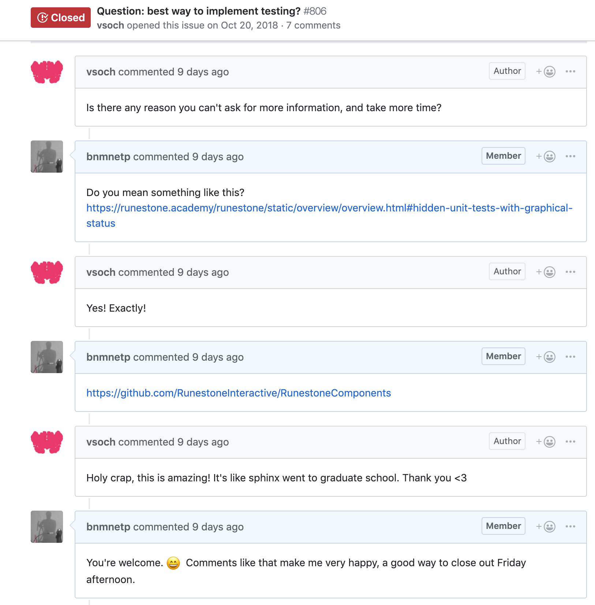

Docker: an Open Source Story
============================

I love the open source world!  You never know what amazing new project you will find, or who you will meet that is willing to contribute some amazing new skills to your project.  This last week provided a great example of the kinds of synergies that can happen here.  It started with a very short conversation on another project I'm involved in called `Skulpt <http://skulpt.org>`_ -- it is the Javascript implementation of Python that we use in the textbooks.

Just a couple of days later `@vsoch <https://vsoch.github.io/>`_ and another contributor to the RunestoneServer who turned out to be already know each other found each other on another line of conversation!  A couple days later Runestone got 100 times easier to install!  Runestone Server has been containerized!!  Why am I so excited??

As a small-ish open source project, with a limited number of contributors, it is really hard to provide a server like the Runestone Server that runs under all possible configurations of Windows, macOS, and Linux.  Those three variations alone are a lot to keep track of, but when you add in all of the individual customizations that developers tend to do on their systems, the number of possible permutations is HUGE.  Docker helps solve that by allowing US to control the environment in which the server runs.  Yay!  That is a giant sized win for us.

Even if you don't know any of the details, you've probably heard of Docker.   Docker is a tool designed to make it easier to create, deploy, and run applications like the Runestone Server by using containers. Containers allow a developer to package up an application with all of the parts it needs, such as database servers, libraries, Python packages, and other dependencies, and ship it all out as one easy to install package.

So, YOU get a virtual environment that runs on your machine that we can specify, that makes it easy for you to install; and WE get a system that lets us control all of the libraries and dependencies so that you can get a running version of our server with a minimum of fuss!  If that is not a win-win scenario I don't know what is.

Wow, that sounds Awesome, how do I get started?
-----------------------------------------------

Well, you will still need a little familiarity with the command line.  You will need to be able to run some docker and git commands.

For potential developers and contributors to the project, or for instructors who may need to run their own server due to university privacy policies or whatever the process of getting Runestone Server up and running is pretty straight forward.  You can see the `details here <https://github.com/RunestoneInteractive/RunestoneServer/tree/master/docker>`_ But lets  walk through a conceptual overview of the process here.

1. Install `Docker <https://docs.docker.com/install/>`_  Yes, its a pretty big thing you have to install, but its been done millions of times and it really just works.
2. Clone the Runestone Server project from github (git clone https://github.com/RunestoneInteractive/RunestoneServer.git)
3. Choose one or more books you want to use in your course, or use in development, and clone them into the books folder of Runestone.
4. If you want to pre-populate users and or instructors you can make a csv file called ``instructors.csv`` and another called ``students.csv``
5. Build the docker container
6. Run the docker container

The above steps will build the books you want to use in the course, populate a database with all the necessary tables and data to run Runestone as well as any instructors or students you want set up, and then start the RunestoneServer.

Again, detailed instructions are linked above, but it really is a lot easier than it was before.  In addition, If you are a developer, you can simply make changes to the code right where you have cloned it and the Docker container will pick up those changes on your next request.

I think this could be a real breakthrough for getting more developers up and running quickly, and reduce support time for people who want to run their own server at their school.  In any case I encourage you to give it a try, and please, please do report any problems you run into with getting a server up and running.

Runestone and Open Source
-------------------------

Much of Runestone is built with the help of other open source projects. I like to think of it as the "family tree" of the project.  The root system goes very deep as every one of the projects that I mention is built on top of many other other open source projects.  We are truly standing on the shoulders of thousands of giants who make make this open source eco system work.

Here is a list of our first level ancestors.  I'm sure I'm leaving something or someone out and I apologize if that is you.  Please let me know and I'll update the post.

* `Skulpt <http://skulpt.org>`_ - Javascript Implementation of Python
* `Sphinx <http://www.sphinx-doc.org/en/master/>`_ A tool for making beautiful documentation that is highly extensible.
* `Python Tutor <http://pythontutor.com/>`_ Awesome tool for visualizing code
* `web2py <http://www.web2py.com>`_ Our web development framework
* `Docker <https://docs.docker.com/>`_
* `Python <www.python.org>`_
* `ShowEval <https://github.com/asweigart/showeval>`_
* `How to Think Like a Computer Scientist <http://openbookproject.net/thinkcs/python/english3e/>`_ - The original text before we made our interactive edition.
* The number of Python packages approximately 75 are too many to mention individually.
* All of the books published on Runestone are open source projects.

.. author:: default
.. categories:: Development
.. tags:: none
.. comments::
