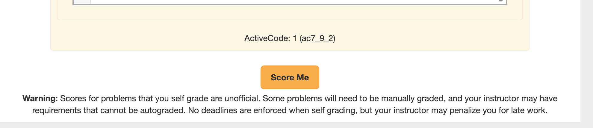
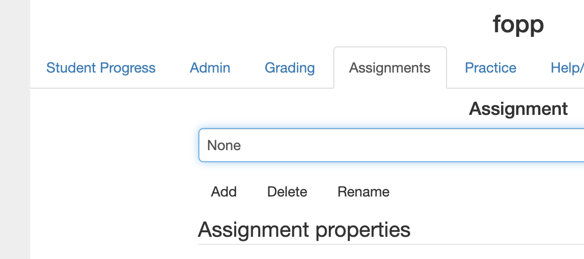

User Interface Polish
=====================

In my last update I detailed some improvements to Runestone that had been a long time in the making.  Today, I want to share some improvements to the UI that have come directly from new contributors that are also actively using Runestone in the classroom.  These are designed to help make your experience using Runestone more pleasant.  I'm sure that there is much more we can be doing, but its really great when the changes and requests from from people who are using Runestone every day.

Grading
-------

**Self Grading** Have your students ever complained that they don't know what they have left to do to complete either a Reading Assignment or a Problem Set?  Probably, have you resorted to running the autograder a few days early and releasing grades so that your students can see what they have left to do?  Now students can "grade" their own assignments.  At least that parts of it that can be automatically graded.

After the student presses the button they will see their scores and progress for every part of the assignment.  If they are not getting full credit for a section of the reading, they can click on the link and finish the activities on that page.  If they are not getting credit for a programming problem they can continue to work on it until all the unit tests pass.  If a problem requires manual grading it will just show a message "Not Yet Graded".

**Multiple Selections:** Have you ever wanted to streamline your manual grading by selecting a bunch of students at once and having all of their code visible rather than selecting them one at a time?  You can now do that!

Assignments
-----------

Not all of us have a good naming convention in mind for our assignments at the beginning of a semester.  So, one simple but  popular request is to be able to **rename assignments.**  You can do that now.

Making an assignment with all automatic grading

Student Progress
----------------

.. author:: default
.. categories:: none
.. tags:: none
.. comments::
