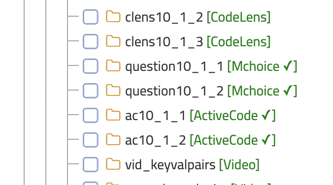
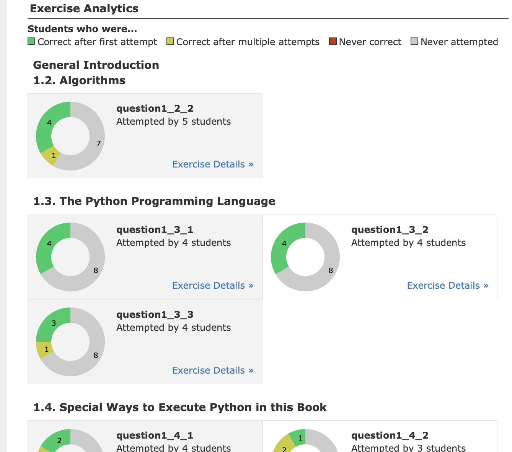

User Interface Polish
=====================

In my last update I detailed some improvements to Runestone that had been a long time in the making.  Today, I want to share some improvements to the UI that have come directly from new contributors that are also actively using Runestone in the classroom.  These are designed to help make your experience using Runestone more pleasant.  I'm sure that there is much more we can be doing, but its really great when the changes and requests from from people who are using Runestone every day.

Grading
-------

**Self Grading** Have your students ever complained that they don't know what they have left to do to complete either a Reading Assignment or a Problem Set?  Probably, have you resorted to running the autograder a few days early and releasing grades so that your students can see what they have left to do?  Now students can "grade" their own assignments.  At least that parts of it that can be automatically graded.

.. image:: self_score.png
    :width: 600

After the student presses the button they will see their scores and progress for every part of the assignment.  If they are not getting full credit for a section of the reading, they can click on the link and finish the activities on that page.  If they are not getting credit for a programming problem they can continue to work on it until all the unit tests pass.  If a problem requires manual grading it will just show a message "Not Yet Graded".

**Multiple Selections:** Have you ever wanted to streamline your manual grading by selecting a bunch of students at once and having all of their code visible rather than selecting them one at a time?  You can now do that!

Assignments
-----------

Not all of us have a good naming convention in mind for our assignments at the beginning of a semester.  So, one simple but  popular request is to be able to **rename assignments.**  You can do that now.

.. image:: rename.png
    :width: 600

**What can be autograded?**  When making an assignment, I know this was a bit frustrating.  Now the Tree View of the avaialable exercises tells you what kind of thing each question is, AND if there is a checkmark next to it then you know that it will be autograded. Better yet, the system now does a much better job of setting the correct default grading option for you when you add something to an assignment.

Help Wanted
~~~~~~~~~~~

We know there are lots of coding exercises that could be autograded but are not. This is due to a lack of hours in the day.  Almost anyone can help solve this problem.  Writing tests is not that hard to do, and I'll take the tests any way you are willing to give them to me.  I'd love it if they were a Pull Request on github, but I'll take them in the form of emails, or posts on the Google Group, or tweets, or Slack messages or whatever way you want to get them to me.  Here is an example of how easy it is to add a unit test to the code in any exercise. `Unit Tests for Code <https://runestone.academy/runestone/static/overview/overview.html#unit-tests-for-code>`_ . This problem is so solvable if we can get a community effort behind it.  If everyone teaching using runestone sent me one unit test a week, think of how much better your lives would be to have more programming exercises that could be automatically graded.  -- Not to mention how much better your students learn when exercises are automatically graded.

How about offering a little extra credit to your advanced students for writing unit tests to exercises they have already done??

Student Progress
----------------

Speaking of student progress a little polish has been applied there too.  The "donut charts" are now organized by subsection.  And the dropdown menu has Chapter Numbers!  This makes it a lot easier to guage what is going on in your class at a glance when you can see the donut charts grouped by sub chapter.

Squashing Bugs
--------------

We have also squashed a fair number of bugs this summer. Just two days ago I corrected a really annoying grading problem thats been around for 3 years!  I've also found ways to eliminate (or ignore) the cruft in our database that sometimes throws off the count of exercises for reading assignments!  Little by little we are making things better and more reliable.  Please do report any problems that you run into.  Again preferably on `Github <https://github.com/RunestoneInteractive/RunestoneServer>`_ That makes it so much easier for us to track.

.. author:: default
.. categories:: Development
.. tags:: none
.. comments::
