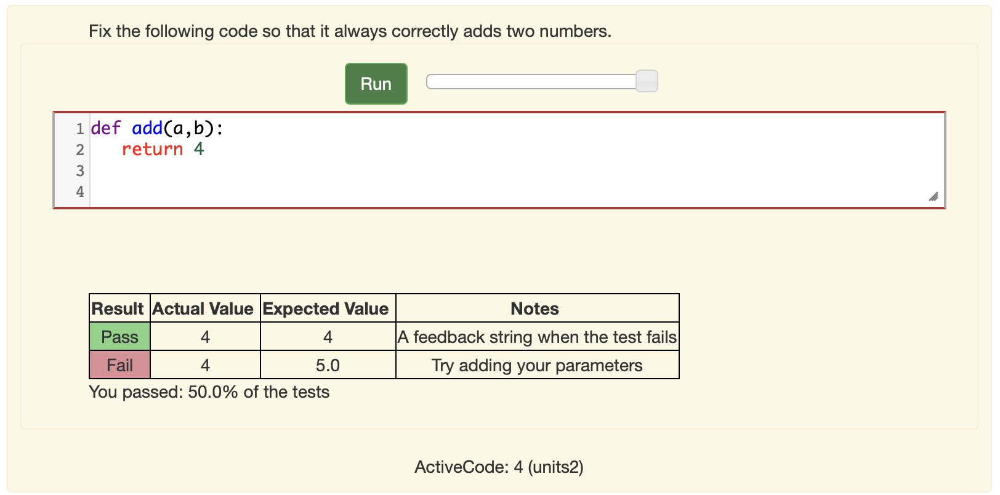
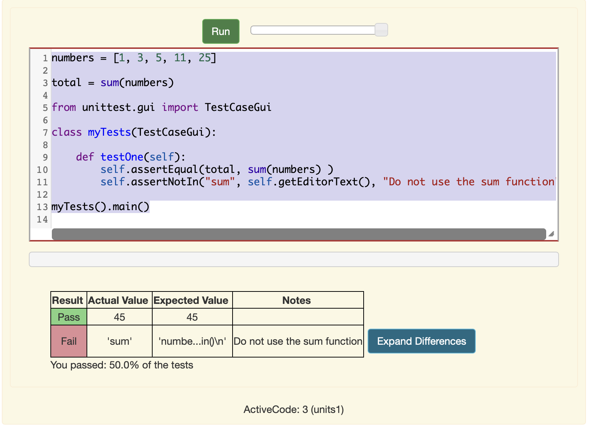

Help Wanted - Make Autograding Awesome
======================================

What if I told you that just 10 minutes a day for one week between now and September 30th could improve your life dramatically for the entire semester?

Did I get your attention?  How much time would you save if every programming problem in Runestone had unit tests so it could be auto graded?  I know I would save me many hours!  In addition my research has shown that students work harder, and end up with much better solutions when an exercise has a good set of unit tests.  It seems like a win for everyone!  When there is that positive affirmation that you are correct,  students build confidence and feel better about doing the work.  In addition, all the emails I get asking for solutions will go away because if all the unit tests pass people will be happy that they have succeeded.

Most of the programming exercises for Foundations of Python Programming, as well as those in How to Think Like a Computer Scientist lack good unit tests for the autograder.  This is actually an easy problem to solve if we crowd source the solution. If all of us using Runestone in our classrooms write a unit test every day we could have 100% coverage.

Adding unit tests to nearly every activecode is an achievable goal, if we work together to write them.  All the cool kids are doing crowdsourcing today, so why can't we?  Here is the best thing, I’ll take a set of tests for **any activecode in (nearly) any format.**  Just send me the title of the book, the activecode ID (shown below the activecode) and a set of assertions, and I (or another volunteer) will get that information in the book.  With the new architecture, as soon as I do a rebuild all of us will immediately benefit from the new tests.  You can send me an email.  You can post it in the comment section of this blog.  You can create an `issue on github <https://github.com/RunestoneInteractive/RunestoneServer/issues>`_  Or you can post the message on our Slack Channel. (See the Support tab for the link to join).

The test you send me could be as simple as.

::

    Dear Brad,

    For activecode ac_2_5_blah we should test the following conditions

        for starting input of 44 and 15
        variable foo should have the value of 29
        variable bar should have the value of "hello world"
        The output should contain the word awesome
        the source code should not include the word append

    Sincerely,

    <insert your name here>

Thats it, we'll take it from there. You could also make Pull Request on github if you know how to do that. 

**You do not need to be an expert to do this.**  You could even make this an assignment for your more advanced students.  I promise I won’t yell at you if you leave some corner case uncovered.  Someone else will probably think of it.  I, and a couple of other folks will act as the editors to make sure we have good tests that cover a reasonable set of cases for each problem.

What does a unit test look like?
--------------------------------

Here is the ideal submission.  (Again, I’ll take much less than this)

.. code-block:: python

    from unittest.gui import TestCaseGui

    class MyTest(TestCaseGui):

        def test_XXX(self):
            assertEqual(variable, correct_value, feedback)
            assertEqual(function_call(), correct_return_value, feedback)
            ...

    myTest.main()

What about problems without functions?
--------------------------------------

No problem, you can make an assertion that a variable should be equal to a value just as easily as a function.  Now, many problems are not stated precisely in the sense that we have not stated clearly.  Store the result in “variableX”.  That is easily changed as well,and you get the satisfaction of knowing that your variable name will be used by thousands of students.

You can also make assertions about the output as well as the assertions words that appear in the source code.

For example lets say you want to write a unit test to check that the ever popular "hello world" program works.  We will use the ``getOuput()`` method to grab the output of the program.  Its just a string so we can manipulate it and assert that substrings be in the output!

.. code-block::  python

    print("Hello World")

    ====
    from unittest.gui import TestCaseGui

    class myTests(TestCaseGui):

        def testOne(self):
            self.assertIn("Hello World", self.getOutput(), )

    myTests().main()

Note that the ``====`` tells Runestone to hide the test code following the ``====`` from the student.

Looking for multiple answers in the output is easy to do with a number of assertions.  So, this would be a good strategy for having them try several test cases.  Even when using the input function!

Or, lets say you want the students to calculate the total of a list of numbers but you don't want them to use the sum function, and you want the result to be stored in the variable total.  We also have access to the source through the ``getEditorText`` method.

.. code-block:: python

    numbers = [1, 3, 5, 11, 25]

    total = sum(numbers)

    ====
    from unittest.gui import TestCaseGui

    class myTests(TestCaseGui):

        def testOne(self):
            self.assertEqual(total, sum(numbers) )
            self.assertNotIn("sum", self.getEditorText(), "Do not use the sum function")

    myTests().main()

This would result in:

What if I have already written a unit test for problem xxx?
-----------------------------------------------------------

Even better!  Just send me the unique id for the problem you created, and (if you know it) the id for the problem you started with.

I know we are all super busy, but with just a few minutes from each of us we can really make a huge dent in reducing our grading workload.  Think about it this way:  when you make the assignment,  jot down a few ideas about what you are going to look for when the students hand in their work,  or even write up the unit tests in an editor. If you get them to me, and we get them into the book before the deadline, all you have to do is make sure your students run them one time with the tests in place and your grading for that problem is done!  I think this can pay for itself with a single assignment!

Thanks in advance for your participation!

Brad

.. author:: default
.. categories:: Development, Community
.. tags:: none
.. comments::
