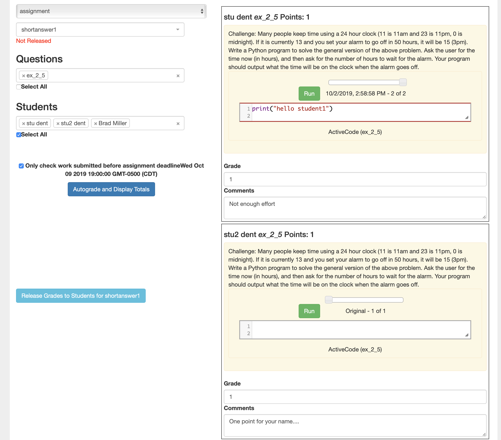

Grading Updates
===============

Lots of updates to the Grading interface this week, as well as some important
bug fixes.  They are now live.  The main things to look for include:

1. I have plugged a couple of holes in session handling, where students could
mistakenly end up in the open fopp book instead of in the correct course.

2. In addition, if the student is not logged in, the progress bar at the bottom
of the page will be gray instead of green.  Another visual indicator that they
are not logged in.

3. The grading interface has been redesigned into a new layout, and streamlined
significantly.   Important note -- these changes are to make manual grading workflow less tedious.  The **autograder workflow** is unchanged.

	1. Now you only have one choice to make.  Start with either a Chapter or an Assignment.
	2. Questions for chapters are sorted alphabetically
	3. Its easy to select all question or all students or both.
	4. Chapters, Assignments, Questions, and students are all searchable.  So if you have a class of 125 and need to regrade that one student it is easier to find them.
	5. If an assignment has not had its grades released there is a bright red message to that effect that will remind you to press the button.
	6. If you select multiple students you can navigate from score to score with the tab key and when you update the score it autosaves when you move to the next input field.  You’ll know it has saved because it will turn light green.
	7. If you like grading things one at a time, the old save and save/next buttons are still there.

Here is `quick video tour <https://youtu.be/x3oCWpFXTdw>`_ of the new features:

Please don't hesitate to leave a comment on other things I could tweak to make the workflow more clear or efficient.

.. author:: default
.. categories:: Announce, Development
.. tags:: none
.. comments::
