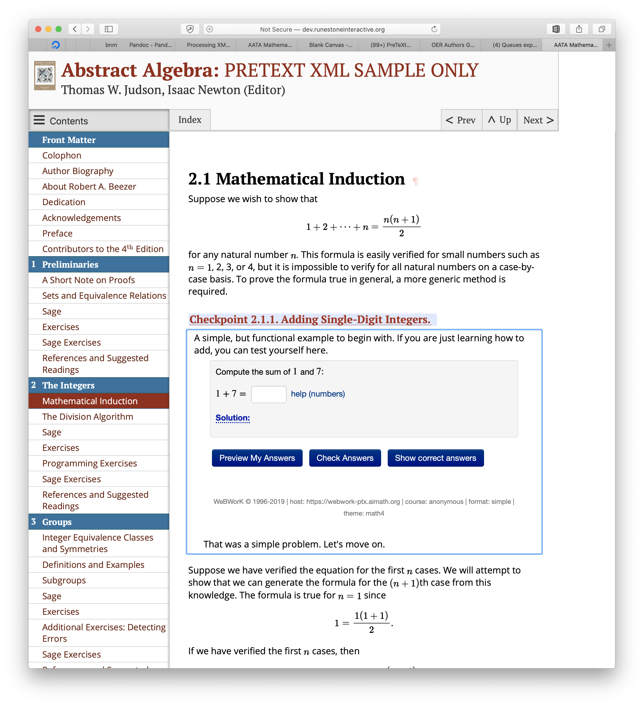

PreTeXt + Runestone: a New Partnership
======================================

I’ve just returned from an inspiring weeklong workshop on Interactive Assessments in Open Source Textbooks, hosted at the `American Institute of Mathematics <https://aimath.org>`_ offices in San Jose.  There were about 25 participants in the workshop, including, authors, instructors, developers, administrators, and people who wear combinations of those hats.  Not only was the workshop inspiring, but the structure of the workshop encourages concrete progress, and I’m thrilled to say that we were able to demonstrate several aspects of a working integration between Runestone and  `PreTexT. <http://pretextbook.org>`_  Although our teams have been working in parallel for several years, it is clear that our goals are well aligned.  The PreTeXt markup system provides over 50 different online resources to the math community  including textbooks for Calculus, Linear Algebra, Discrete Math and much more.   Both PreTeXt and Runestone have a lot to bring to a combined table and here are some of the ways that the entire community may benefit from an integrated system:

- PreTeXt does not have a central hosting system like Runestone.Academy, nor does it collect the data for the kinds of instructor analytics that Runestone does.
- While PreTeXt makes use of `WebWork <http://webwork.maa.org>`_ for interactive exercises WebWork does not have all of the different components that runestone has
- PreTeXt has a different markup language than Runestone - based on XML - it is not complicated to write and less fussy than restructuredText in the use of whitespace in its Syntax
- PreTeXt can produce documents in many different output formats including online as well as PDF, ePub, and in-progress work on Braille!

    *Serving a PreTeXt book with a Runestone Server integrating a WebWork question*

During the week we were able to make PreTeXt output html that was compatible with several different Runestone components, including activecode, multiple choice, and short answer questions,  the rest will follow over the coming months!  This means that an author could write in PreTeXt and host a book on Runestone.academy.  In fact were were able to demonstrate that we could already host existing PreTexT books, and with a little work we were able to capture student responses from WebWork problems and save them to the Runestone database.

In addition to the integration work, there was a lot of conversation and drawing of pictures and making of lists that revolved around topics that both Runestone and PreTeXt could benefit from. Some of it is great design work, some of it is a vision of how the future could look, But the answers to the questions will provide lots of work for the next few years.

1. How can we write and present instructor editions of textbooks?  What kinds of resources should be included in an instructor edition and how best to expose those materials.
2. How can we build effective communities around the various textbooks we provide to encourage instructors to help and learn from each other?
3. What kinds of analytics would be useful for book authors?  How can the data collected for authors be visualized effectively to help authors write more effective textbooks?
4. How can we write questions that can have many equivalent variations, to promote better student practice and learning.
5. To what extent should instructors be able to customize a textbook?  How can we allow customizations without a dizzying and confusing proliferation of minor variations of the text?
6. How can we collect data to enhance student learning, while still respecting student’s privacy and respecting an increasing number of privacy laws?
7. What can we do to ensure that creators of open source educational resources get the proper credit towards tenure and promotion for work that has a wide impact?  Sure a journal paper that is read by 6 other people is fine, but isn't a book that educates thousands of students and moves pedagogy forward at least as valuable?

I’m not going to provide answers to those questions here as that work will be ongoing and we could use a lot of help.  If you are interested in tackling any of these questions or just participating in the discussion, please let me know!

I also learned about the `DOENET <https://math.umn.edu/seminar/distributed-open-education-network-doenet-and-your-dream-educational-technology>`_ project happening across many universities with the project manager located at the University of Minnesota.  This would be a longer term integration project that could address many of the privacy issues surrounding open source education materials.  And since I’m only seven minutes away from DOENET central by bike, we decided to focus on other integration issues during this workshop, and get together after the conference to start this discussion.

In closing, I want to thank the organizers of this workshop -- Jim Fowler, Mitch Keller, Matthew Leingang, and Oscar Levin for inviting me to participate.  Thanks to the other participants who made the non-math guy feel extremely welcome! Thanks to Rob Beezer and David Farmer for inventing and writing PreTeXt and being so open to working on integration, even well into the evening after the workshop was done for the day.

I hope someone from the ACM will read this, and look into creating and funding workshops with a similar format. This was 100% a week well spent -- Not something you can say after every conference!  This workshop was a great beginning and I look forward to seeing what we can do together.

.. author:: default
.. categories:: Community, Development
.. tags:: none
.. comments::
