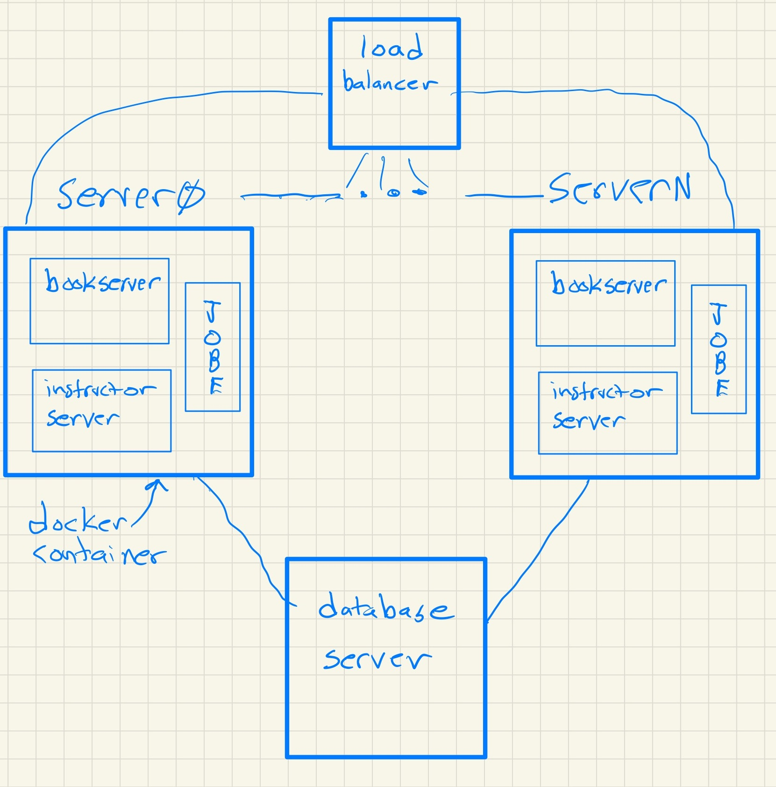

Academy Downtime
================

Runestone Academy is undergoing some major upgrades this holiday season! Unfortunately these changes will result in some downtime.  Here is our schedule of events so you know what to expect in the coming weeks.

1. **December 25 - 26** Runestone will be **offline** as we move our database server to its own machine.  In order to ensure that we don't lose any data we need to take all of the books offline while we move the database.  This is also a great time for us to do some maintainance on our data in preparation for our new servers.

2. **December 26-27** Bring Runestone.academy back online.  In this initial period the old servers will come back up but use the database in its own location.  There may be some unexpected crashes during this period as we have added a number of protections to the database to keep future data problems.

3. **December 27--January 1** Migrate away from the old server and onto the new servers.  If all goes well this is mostly just some DNS changes, but it will still likely cause the appearance of some downtime as you may not reach the new server and / or the old server may look like its certificate is expired.

4. **January 3 and onward** Back to business as usual.  Although there are likely to be some hiccups as traffic picks up with students and teachers getting back to school.

A Few Details
-------------

For those that are interested, this change is pretty big.  Here is what Runestone has looked like in the past:

.. image:: oldserver.jpg
    :width: 600

Runestone.academy runs the web2py application server as well as the database server (postgresql).  This server has been in service since 2017.  I haven't had to reboot it for 695 days as of this writing!  It is definitely showing its age, and can definitely not keep up with all of the traffic.  Our stopgap measure to alleviate the pressure on this machine was to add csawesome.runestone.academy and route all traffic for the csawesome book to that server.  It still used the database on academy.  And it used most of the cpu power of the five jobe servers that compile over 100,000 Java programs each day.  If it looks like this is a "Rube Goldberg" contraption its because it is.

For years we have wanted to move to a new architecture.  And this change is our first step in that direction.  This new architecture is all based around Docker containers and gives us the ability to add more capacity in just minutes.  It will also let us scale back during the less busy summer months, thus saving us money as well.

All traffic will now go to runestone.academy.  It will be routed to one of N docker containers that run the old server which is now just for the instructor dashboard.  Page requests for books will be handled by our brand new bookserver.  This new server is built using a very modern web framework and will have a ton of benefits for developing new features going forward.
Each container also houses a JOBE server for handling java and other compiled languages not supported in the browser.

Warning
-------

Any big change like this is bound to come with some setbacks.  I'm sure there are things around the edges and in the corners of our new server that will break over the first couple of months. Please be patient, and please please report problems on our `github issues page <https://github.com/RunestoneInteractive/RunestoneServer>`_ Don't assume that someone else will report a problem or that it is your own fault.

It will also take us some time to tweak the performance of this new setup.  We have had almost five years to squeeze as much performance out of the old system as we could.  It will take some time to get the most out of this new one as well.  So again please be patient and let us know of any particular bottlenecks.

Please Support Runestone
------------------------

As long as I have your attention, and we are at that end of the year time when we think about supporting the organizations that matter to us, please consider a small donation to keep runestone solvent.  You can donate directly on `PayPal <https://www.paypal.me/runestoneinteractive>`_ Thanks!

Enjoy the holidays!

Brad

.. author:: default
.. categories:: Announcement
.. tags:: none
.. comments::
