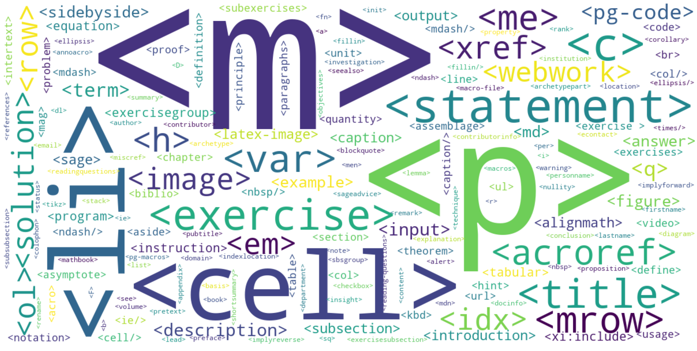

PreTeXt Runestone Workshop
==========================

Happy July 4th Weekend!  I am glad to be home after almost two weeks in Ann Arbor Michigan.  But it was a great two weeks.  Here are a few of the highlights.

The week of June 20 -- 24 was the first joint workshop with the PreTeXt team.  We had 28 attendees including authors, developers, educational researchers, and instructors representing the Runestone and PreTeXt projects.  One of the main goals for the week was to give everyone a chance to get to know each other and learn more about the two projects.

The PreTeXt Runestone Partnership
---------------------------------

After spending an entire global pandemic working on integration Rob Beezer and Brad Miller presented the integration of Runestone and PreTeXt.  PreTeXt now has the ability to natively author most of the Runestone Interactive exercises including multiple choice, Parsons problems, Matching, clickable area, short answer, fill in the blank, activecode, and CodeLens!  Rob has built a very nice `annotated sample book <https://pretextbook.org/examples/sample-book/annotated/exercises-12.html>`_ (`alternative link <https://pretextbook.org/examples/sample-book/noparts/html/interactive-exercises.html>`_ without source annotations) that illustrates these questions in action.  Runestone Academy can now host books written in PreTeXt and fully supports using questions written in PreTeXt in our analytics and assignments.

Going forward PreTeXt will be the primary authoring language for books hosted on Runestone Academy.  We will continue to research and develop new interactive components but we will not have to worry about inventing markup.  If you are a current Runestone author I think you will really like the consistency and expressiveness of PreTeXt.  It may take a bit to get used to the more verbose XML style of writing, but is well worth learning for future development.  There are many advantages to using PreTeXt as an authoring language.

* PreTeXt books are highly accessible
* PreTeXt books that are interactive on the web can also be rendered in various static forms including pdf, ePub, Kindle, Braille, and more.  We make two types of PDF, one is meant specifically for print/print-on-demand.  If you want a bound copy of a book, you can get it!
* PreTeXt books are highly structured, which will allow for more customization in the future.  We spent a lot of time during the workshop talking about various ways we can make the textbooks more customizable.

One big topic of discussion at this workshop is how to grow the PreTeXt Runestone ecosystem.  With our combined forces we need to do more in the following areas:

* Developing champions for each textbook to develop community around each textbook.
* Developing instructor materials for each book
* Improving videos
* Doing more blogging
* Creating a new home page for Runestone Academy that is more informative about what we are.
* Being visible at conferences and workshops.

New Titles Coming to Runestone Academy
--------------------------------------

Starting this summer we are converting many of our current books to use the PreTeXt markup language.  The first of these is also the first textbook to be converted to Runestone.  How to Think like a Computer Scientist: Interactive edition.  We are finalizing the conversion, but I encourage you to take a look at what we have done so far on our `development server <https://dev.runestoneacademy.org/ns/books/published/httlacs/index.html?mode=browsing>`_
I am super excited to see this all come together and you will see many other textbooks undergoing the conversion soon.  In addition we will have a lot of other new titles available for the Fall.

* Ordinary Differential Equations
* Discrete Math: an Open Introduction
* Active Calculus
* Apex Calculus
* Elementary Algebra
* Intermediate Algebra: Functions and Graphs
* Trigonometry

I am also pleased to announce that the classic `Java Java Java: Object Oriented Problem Solving <https://runestone.academy/ns/books/published/javajavajava/index.html?mode=browsing>`_ textbook is now available.  Although this textbook was originally authored in LaTeX we have the scripts to convert to PreTeXt. If you have a open source textbook in LaTeX or practically any other format we can convert it to PreTeXt just like this one.  Of course the conversion is only part of the work.  What we talked a lot about at the workshop is how interactive textbooks that support active learning are structured quite differently than a traditional book.  Our research shows that students jump straight to the questions or activities and only come back to read the text when they don't understand the material. This makes for much more engaged readers.

New Features
------------

One of the features of the workshop was a sharing of a lot of research done by the PreTeXt team as part of the `UTMOST <https://utmost.aimath.org/pretext/>`_ project sponsored by NSF.  We also got a demo of a new feature of Runestone Academy that allows you to do Peer Instruction in your classroom.  This peer instruction feature was the focus of the second workshop the week of June 27.

For Runestone authors it is also exciting to know that `Sage <https://www.sagemath.org/>`_ and `the R language <https://www.r-project.org/>`_ are both supported natively by PreTeXt.

Starting a new book
-------------------

It is easy to get started writing a book with PreTeXt using the `PreTeXt command line tool <https://pretextbook.org/doc/guide/html/processing-CLI.html>`_.  This tool allows you to quickly start a book, build books, and see updates to your book as you write.  In addition there is also a `great extension <https://marketplace.visualstudio.com/items?itemName=oscarlevin.pretext-tools&ssr=false#overview>`_ for Visual Studio Code!

We are working on an editor designed specifically for PreTeXt that will make it super easy for anyone to edit a PreTeXt textbook, more on that another day.

The future
----------

One of the biggest goals for both PreTeXt and Runestone is to ensure that these projects thrive for many years into the future.  This means growing the combined team, finding funding and many other things.   If you are interested in getting involved in any way we would love to have you join the team.  You don't need to be an expert coder, you don't even need to know how to code at all.  We need willing proof readers, editors, testers of new features, community builders, bloggers, and authors.  You don't need to be a mathematician or a computer scientist either, great open source textbooks are a benefit to students `studying any topic! <https://musictheory.pugetsound.edu/mt21c/MusicTheory.html>`_

.. author:: Brad Miller
.. categories:: Announce, Community, History
.. tags:: none
.. comments::
