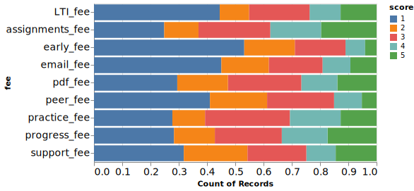
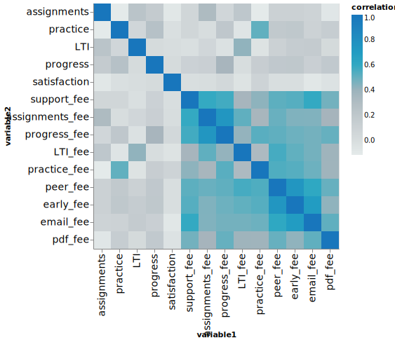
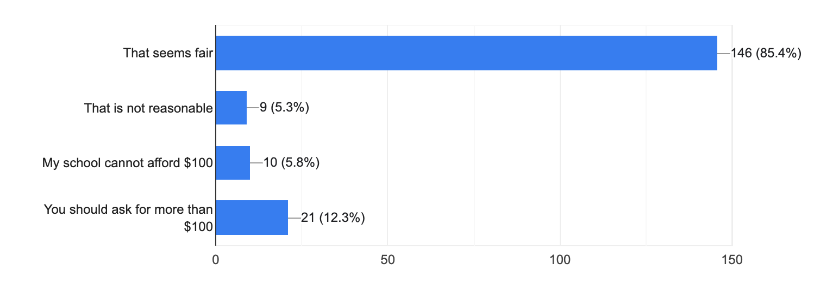

Instructor Survey 2022
======================

Let me start out with a big thank you to everyone who responded to the Instructor Survey over the last few weeks!  About 200 of you took the time to answer the questions.  The results as I watched them come in were remarkably consistent.  I would like to break down the results into four sections:  Features you value, Features you might be willing to pay for, Contracts and Privacy, and Thoughts on the future.

Features you Value
------------------

The following graph summarizes the responses to the first four questions.  Recall that 1 is least important and 5 is most important.

.. image:: features.svg

I was a little surprised by how many instructors said that LTI was really not important, nearly 50% of respondents rated the importance of LTI a 1.  Assignments and grading, practice, and tracking student progress were rated a 4 or 5 by 60% That reaffirms that these are our core features that you rely on.  Although reading through the open text response it is clear that we can make the assignment and grading pages much better.  I've started a redesign of those in my head, but I would love to hear from you on what exactly the pain points for you are.  I heard words like clunky, cumbersome, difficult, and those are somewhat helpful but some detail would sure help.

The thing that made me the most happy was the overall satisfaction score with over 90% of the responses rating us a 4 or 5!  There were so many nice comments in the text section that I will read again and again on the days when I am slogging through the code trying to fix some obscure bug!

Features you Might be Willing to Pay for
----------------------------------------

I know the question was a big vague, and I think think that it led to some unnecessary panic by some of the respondents.  What is clear to me is that there is a section of our user base that values Runestone Academy and would like support us.  There is also a sizable number that come from school districts that would not have the budget to support us even though you might want to.  This latter group is why Runestone exists, we exist to serve you and we want to be here for you. Recall that 1 is least likely to pay and 5 is most likely. Here is the summary graph:

A couple of things people are clearly not interested in paying for:  early access to features, dedicated email support, LTI.  But about 20% of respondents would be willing/able to  pay for a support fee, access to the student progress features, the practice feature, assignments and grading, PDF copies of the books, and even LTI.  Because I'm kind of a nerd I made a correlation matrix:

This does show some interesting correlations that may suggest a way forward.  First there is a 0.5 correlation between those who value the practice feature and those that would be willing to pay for it. This is also true of LTI at 0.42. Assignments and Grading and Student progress are at around 0.3.  I think it is kind of cool that satisfaction is not correlated with anything.  One might hypothesize that the more satisfied you are the more you are willing to pay.  But it is probably just be that because 90% of the responses were very satisfied that there is not much to correlate with.

Contracts and Privacy
---------------------

I have written about this a lot in the past.  Processing these contracts that schools want me to sign is a major time sync and a terrible use of my time.  Nearly all of them require Runestone to promise to reimburse the school for costs associated with a data breach!  For a service they are not paying for!  Is it reasonable to charge schools a $100 fee to process these?  As the following graph shows the overwhelming majority 85% feel it is fair.

I would love to hear the reasoning of why 5% of the responses do not think a $100 fee is reasonable. I suppose you might think that I should trust your school.  They are not out to get me, just to protect their students.  But that is no way to run a business.  More and more I have become convinced that Runestone Academy needs to have a Cyber insurance policy.  I am happy to say that after an extensive search and a LOT of back and forth with underwriters we have finally obtained a policy.  But, guess what... They don't give those policies away for free, they charge a substantial premium that adds to the cost of running Runestone.

Thoughts on the Future
----------------------

I want to start this section by reminding everyone of why Runestone Academy exists.  We exist so that we can make high quality, accessible textbooks available to students no matter their economic situation or physical limitation.  Too many students do poorly because they cannot afford (and therefore do not buy) the textbooks they need for class.  We exist to provide students engaging books that help them learn more effectively than paper books.  We exist to help teachers teach more effectively by providing them feedback about their students.  We exist to help authors and researchers do their jobs more effectively by providing a system where they can experiment with new pedagogical techniques and new technology for textbooks.  You will notice that not once in that list of reasons we exist did I mention the word profit or money.  Making money is not why we exist.  The materials we provide will always be free to students.

Yet the hard facts of the world are that nothing is for free.  We have hosting fees and legal fees and credit card fees and paypal fees in 2021 we had about $28,000 in fees.  That is before I even try to pay myself a salary for working on this full time.  What happens if I disappear?  Is there someone else willing to devote full time to keeping Runestone running for little or no pay?  I haven't met anyone yet, which means we have to get to the point where we can pay someone and keep Runestone sustainable.

There are a few immediate decisions from the results of the survey.

1. Runestone books will continue to be free to all students.  We will not charge the students for access to our books.
2. For all schools with courses beginning after January 1 2023 that want Runestone to sign a contract we will require a $100 contract fee.  If your school cannot **afford** that fee we have options for you to continue using Runestone without a contract.
3. I think that there is room for a "freemium model" to work.  We will work on defining a set of features that will remain free to everyone, for example assignments, grading, and student progress remain free but features like LTI integration, practice and peer instruction may cost a small fee.  I am being transparent about this because |donotpanic| I don't want people to panic, I want to open a dialog to get your feedback and I want to reassure everyone that **if** we do have to charge for some features you will get plenty of notice.  I also want to reassure you that we will do everything we can to find grant money so that everyone who wants to use any book on Runestone Academy can continue to do so regardless of the financial position of the school. 

.. author:: default
.. categories:: none
.. tags:: none
.. comments::
