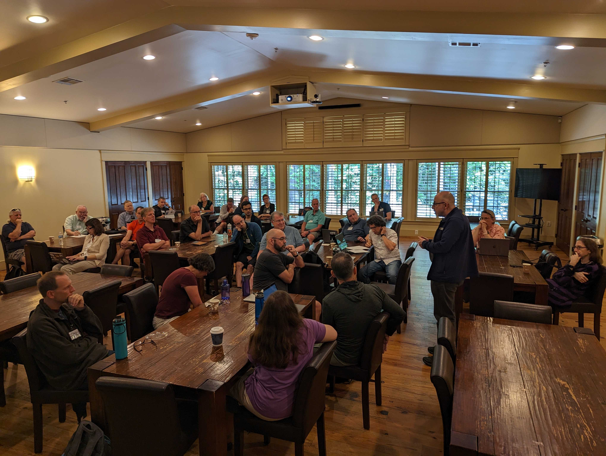

PROSE Workshop Report
=====================

Last week we held the PROSE Organizing Workshop at the University of South Alabama. We had 30 people in person and several more attended virtually. The attendees included seasoned veterans from the PreTeXt and Runestone projects as well as some people completely new to the project. One virtual attendee had literally learned of the project just days before the start of the workshop.  We had a great time and got a lot of work done. We have a lot of work to do still, but we are off to a great start.   In this post I will summarize the takeaways from the workshop and the next steps for the project.

What is the Scope of the Ecosystem?
-----------------------------------

One key question that needed to be answered was What and/or who is the PreTeXt / Runestone ecosystem?
After lots of good discussion we decided that the ecosystem is best described by a set of principles, anyone or any project that shares those principles may be part of the ecosystem.  The principles are:

Our Open Source Ecosystem is a community of students, teachers,  authors, researchers, and developers committed to the following principles:

1. We exist to:
	* Help students learn more efficiently
	* Help teachers teach more effectively
	* Help authors write better materials
	* Enable researchers to develop more effective tools and pedagogies

2. We are committed to ensuring access to the best open source learning environment to all of our stakeholders, but especially to the students who need it the most.
3. We embrace the open web and open standards.
4. We welcome new partners who share our values.
5. We will be flexible in creating a platform that incorporates new innovations.
6. We recognize and celebrate all contributors and innovations that move our ecosystem forward.

In an open source ecosystem we are all "standing on the shoulders of giants," there are countless projects that we rely on to make our software work, however we want to recognize some of the initial projects that are core to our ecosystem:

* `PreTeXt <https://pretextbook.org>`_ - An XML vocabulary for authoring and publishing high quality print and digital textbooks
* `Runestone Interactive <https://runestoneinteractive.org>`_ - A Learning Engineering and Analytics Portal (LEAP) for hosting textbooks, assignments, and interactive learning activities.
* `WebWork <https://openwebwork.org/what-is-webwork/>`_ - An open source online homework system for math and science courses
* `Doenet <https://doenet.org>`_ - An open source platform for creating interactive learning activities

It also includes many textbook authors, instructors, and researchers who are using these tools to create and deliver high quality learning experiences for their students.  Research is ongoing at several universities including the University of Michigan, the University of South Alabama, and the University of Illinois, UT Austin.

Leadership
----------

We have a long term vision for the leadership of the ecosystem that may become a formal entity like the Apache foundation or an academic society.  For our initial work, we have created an advisory council of eight people who represent many different aspects of our ecosystem of Open Educational Resources (OER) and embrace our guiding principles.

The initial leadership council includes the following people, all of whom have committed to an initial two year term.

* `Rob Beezer <http://buzzard.ups.edu/>`_ - Professor Emeritus of Mathematics at the University of Puget Sound, Founder of the PreTeXt project, author of the open source textbook A First Course in Linear Algebra.
* `Matt Boelkins <https://faculty.gvsu.edu/boelkinm>`_ - Professor of Mathematics at Grand Valley State University, author of the open source textbook Active Calculus.
* `Steven Clontz <http://clontz.org>`_ - Associate Professor of Mathematics at the University of South Alabama, maintainer of `tbil.org <https://tbil.org>`_ resource library, and co-author of the PreTeXt-cli authoring toolkit.
* `Barbara Ericson <https://barbarer.github.io>`_ - Assistant professor of Information at the University of Michigan, and co-author of the open source textbook CSAwesome.
* `Danny Glin <https://github.com/dlglin>`_ - The University of Calgary, and member of the WebWork Executive committee.
* `Brad Miller <https://reputablejournal.com>`_ - Professor Emeritus of Computer Science at Luther College, founder of Runestone Academy LTD, and co-author of the open source textbook Problem Solving with Algorithms and Data Structures using Python.
* `Jennifer Nordstrom <https://nordstrommath.com>`_ - Professor of Mathematics at Linfield University, and author of the open source textbook Game Theory: a Discovery Approach.
* `Duane Nykamp <https://cse.umn.edu/math/duane-nykamp>`_ Associate Professor and Director of Strategic Initiatives at the University of Minnesota, and founder of the Doenet project.

This group will guide us through the initial stages of the project and help us to create a more formal governance structure as the project matures.

As part of the next steps we will be creating additional leadership opportunities in the form of **Fellowships** for people who are working to grow our ecosystem.  We will also be funding **mini grants** to inspire and reward contributors to the ecosystem.

Next Steps
----------

There were **so many** great ideas that came out of the workshop, I can't possibly list them all here.
But we did identify some concrete actions that we need to get busy on in the coming months in order to make this project a success.  Here are some of the next steps that we identified at the workshop.

1. Write a `Phase II grant proposal <https://new.nsf.gov/funding/opportunities/pathways-enable-open-source-ecosystems-pose>`_ for the NSF to fund the next stage of the project.
2. Find a name for the project that is more descriptive of the ecosystem, and will allow us to create a website that will be the hub of the ecosystem.
3. Work on ways to keep the community engaged and build on the momentum from the workshop.
4. Develop a plan for making sure that we are defending the intellectual property of the ecosystem.
5. Continue our discussions and planning to create a sustainable funding model for the project beyond the initial NSF grant.
6. Continue the technical discussions that were started at the workshop. These include a working group for improving the user experience on Runestone Academy; a working group for improving the authoring experience for PreTeXt;  continue the the work on integrating Doenet and WebWork with PreTeXt and Runestone.
7. Develop a plan to be more inclusive and diverse in our ecosystem.

.. author:: default
.. categories:: none
.. tags:: none
.. comments::
