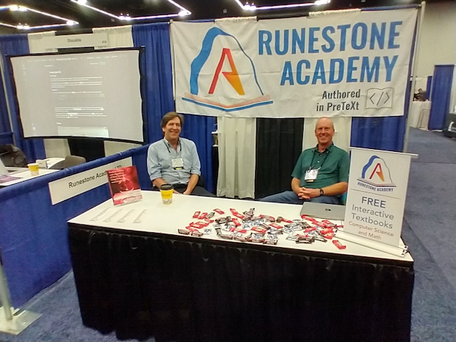
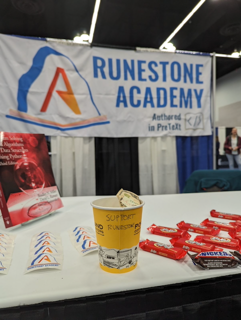

SIGCSE 2024: How do you do it?
==============================

A second SIGCSE is in the bag for Runestone as an exhibitor.  It was a good year.  It was amazing to see so many people who have been using Runestone for years and to hear their stories. The number of people who stopped by the booth to just say **thank you** was really overwhelming! I hope you all know that your gesture will keep me going for months!  It was also great to see so many new faces who were just learning about Runestone.  I am always amazed at the number of people who have never heard of Runestone before.  I guess that is a good thing, it means there are still lots of people to reach.

It was great to connect with so many colleagues from years past.  I was able to catch up with people I have not seen in years.  I was also able to meet some new people who I have only known through email, Zoom, or Discord.  It was great to put real live faces to names.

It was so interesting to hear the questions that people asked. This year felt different than years past.  The top questions were "How do you do it?"  "How do you keep Runestone going?"  "How do you keep it free?" "Are you *really* free?"" And, "do you have a book that covers X?"  But the question I want to address in this post is **how do we keep it going?** I understand that in this day and age the assumption is that "if it's free online then the user is the product."  But that is not how we roll, that is not our mission, that is not our model.  We are a non-profit and we are here to serve the community.  We are not here to make money off of you or your students.  We are here to help you teach and learn computer science and math.  Our North Star is to make computer science and mathematics education **accessible to everyone.**

We had answered that question so many times that we determined that we needed to create a new table banner for next time.  We also decided that we could have a tongue in cheek answer for the rest of the conference, so Rob created a tip jar.  We had a lot of fun with that!  Some people were so amused that they threw in a dollar! We are not going to get rich off of that, but it was fun.

Here is the answer to the question "How do you do it?"  We are a non-profit.  We are funded by donations, grants, memberships, and ads.  We have a small team of volunteer developers who put their effort into Runestone.  We have a medium community of authors who help us keep Runestone up to date.  We have a large community of students and teachers who help us find bugs and suggest improvements.  Yes, professional copyeditors are great, but the masses of students and teachers are even better.

A second part of the solution is to serve ads through the `Ethical Ad Network <https://ethicalads.io>`_.  We don't like ads in general but the Ethical Ad Network is great because they don't do any tracking! Also, we don't show ads to students who are registered for a course.

Finally, we do have a `Patreon <https://www.patreon.com/runestone>`_ account, and a `Github supporter <https://github.com/sponsors/RunestoneInteractive>`_ account, and of course you can `donate directly <https://runestone.academy/donate>`_ We would love to have your support! We are always looking for new ways to fund Runestone, if you are independently wealthy and want to fund us, we would love to talk to you!  If you have a contact at a foundation that might be interested in funding us, we would love to talk to them!  If you have a contact at a company that might be interested in funding us, we would love to talk to them!  We are always looking for new ways to fund Runestone.

Over the long term we are looking for solutions that will enable us to remain true to our mission of making computer science education accessible to everyone. We know there are many commercial offerings that have been *free* and then pulled the rug out from under all of the schools that could not pay.  That is not who we are.  We are committed to keeping the content and as much of the instructor interface free as we can, while planning for the day that Rob and Brad decide to step aside and really retire.  It might mean a freemium model, it might mean a subscription model, it might mean a different model.  We are open to ideas and suggestions as long as we can remain true to our mission.

In the meantime, we are always looking for new contributors.  If you are interested in helping out, please let us know.  We are always looking for people to help us with content, with the platform, with the community, with the business side of things.  We are always looking for new ideas and new ways to make Runestone better.

.. author:: default
.. categories:: none
.. tags:: none
.. comments::
