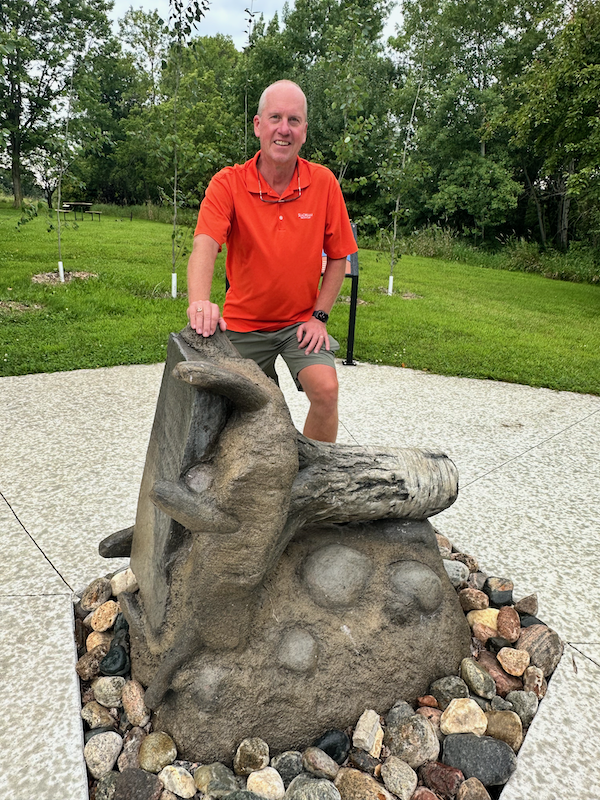

Runestone Origins
=================

I come from a long line of educators, my father, and both of my grandmothers were teachers.  I was lucky enough to spend time with each grandmother many summers during my childhood years.  Each of them loved to bring me on adventures.  My grandmother on my mother's side was a teacher in rural Minnesota.  She took me to see the Petroglyphs and to Pipestone National Monument, and many other places.  My grandmother on my father's side was a teacher in a one room school house in Northern Minnesota.  She would take me to school and give me a nickle to say the pledge of allegiance.  She would also take me on other adventures, including going to see the Kensington Runestone near Alexandria, MN.  I was always fascinated by the story of the Runestone and the mystery of its origins, and of course Vikings!  I have always loved to learn and to teach and I think that my grandmothers had a lot to do with that, both of them helped me become an early reader and supplied me with lots of books.  I hope that you enjoy learning and teaching from the Runestone books as much as I have enjoyed creating and maintaining Runestone Academy.

A few days ago I got to revisit the Runestone when we visited our friends who live near Alexandria. Here I am on the site where the stone was found, entangled in the roots of a poplar tree.

The Runestone is a 200 pound slab of rock that was found in 1898 near Kensington, MN.  The stone is covered with runes that tell the story of a group of Norsemen who came to the area in 1362.  The stone is controversial and many people believe it is a hoax.  The stone is now on display in the Runestone Museum in Alexandria, MN.  I've never understood why an illiterate farmer would go to the trouble of carving a 200 pound stone with a story that no one could read.  I prefer to think that the stone is real and that it tells the story of a group of Norsemen who came to Minnesota 130 years before Columbus.

.. author:: default
.. categories:: none
.. tags:: none
.. comments::
