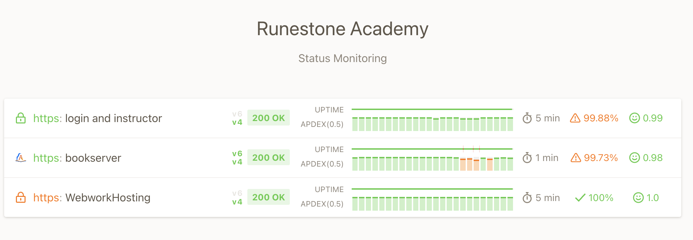

Distributed Denial of Service 2024
==================================

Well, Fall certainly started off with a bang this year. Registrations are ahead of last year, web traffic is also way up,  and we are seeing a lot of adoptions of new books in the Runestone ecosystem.

We are also seeing a lot of new attacks. Specifically, we have been subject to a Distributed Denial of Service (DDoS) attack each day. This is where a large number of computers are used to flood a target with traffic, causing the target to become overwhelmed and unable to respond to legitimate requests.  For example yesterday from about 7:30AM Central to 1:30PM Central, we had over 5 million bogus HTTP requests sent from around 6,000 different IP addresses.  All were identical trying to send some kind of binary request.  A little research indicated that they were probably trying to create some kind of buffer overflow in the web server that would allow them to gain access.

The attack stopped on its own yesterday afternoon.  But then it started up again this morning, though not with as much intensity.

We have been able to mitigate the attacks by blocking the IP addresses of the attacking machines, but it is a constant game of whack-a-mole.  Thankfully, there is an automated system called ``fail2ban`` that can help us with this.  Until we get it fine-tuned there is a possibility that some legitimate users may be blocked.  If you are having trouble accessing the Runestone books, please let us know.

We have also been working with our hosting provider to help us with this.  They are supposed to provide some level of protection against DDoS attacks, but they claim that it only applies if the attack is against a large part of their cloud.

I'm not sure why we are being targeted. Maybe it is just mischief, maybe we just got caught up in the middle of a range of IP addresses being attacked, We don't have any money to pay a ransom and it we haven't been asked to. No matter the motive, it is a good reminder that the internet is a dangerous place and that we need to be vigilant in protecting our systems.

If you have trouble accessing Runestone and are wondering if it is just you or if the site is down please check `The Runestone Status Page <https://status.runestone.academy>`_

The top bar shows the current status of the Runestone servers.  If the bar is green then everything is good.  The orange-red bars crossing the green indicate times when the site was not available to the majority of 7 severs around the world that check periodically. the wider those bars, the longer the site was unavailable. The vertical green bars are the "Appdex score" which is a measure of how responsive the site is.  The higher the better.  This page is served completely independent of our servers so if you can't reach the Runestone site you should still be able to reach this page.  Also, please know that when access to the site is not perfect I get notified by text and email so I can jump in and try to fix things.

Hopefully, things will smooth out now and you can focus on teaching and learning!  Thanks for your patience.

Brad

.. author:: default
.. categories:: none
.. tags:: none
.. comments::
