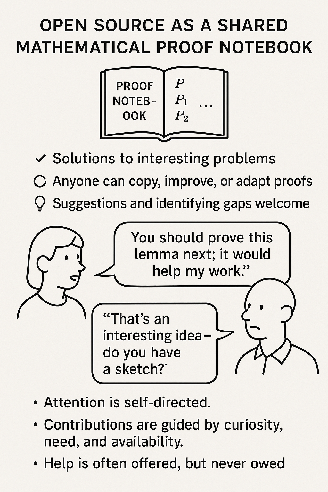

Summer Roadmap 2025
===================

I'm excited to share our roadmap for the summer of 2025!  This summer brings a number of projects both large and small.  Here is a high level overview of what I hope to accomplish:

* **Launching LTI 1.3**: This has been in development for a while, and we are excited to finally launch it.  This will allow Runestone to be integrated into many more LMSs and will make it easier for instructors to use our platform in their courses.  It will also pass back grades for students immediately.  **How can I help?** If you are an instructor and would be willing to test this out with your LMS please let us know!  We want to make sure this is rock solid for the Fall!  BTW, if you have a big IT department who is going to ask me to fill out a bunch of forms and sign a bunch of documents, please know that  this will be a paid for feature.  I just don't have the time and energy to fill out a bunch of forms and sign a bunch of documents for free.  I'll announce the pricing for this in a few week.
* **JOBE Updates**: This is also essentially complete, and updates Java to Java 21 and C++ to C++ 23.  This will allow us to support the latest versions of these languages in our interactive textbooks.  **How can I help?** If you are an instructor who uses JOBE in your course, please let us know if you have any specific needs or concerns with this update.
* **Manual Grading updates**: There are very few things that need manual grading any more. But this is probably the key thing to port away from web2py to FastAPI.  I'm not sure what this will look like but I welcome ideas, sketches, and mockups.
* **New Textbooks**: We have a number of new textbooks in the works, including a new book on Quantum Computing, and a new book on Computer Security.  We will also be phasing out the RST version of how to think like a computer scientist and replacing it with the PreTeXt version.The same goes for the python data structures book. Also a brand new PreTeXt version of CSAwesome, and a PreTeXt version of Python for Everyone.  Each new book that goes from RST to PTX exposes a few bugs, or feature requests.  These are fun to find and fix.  **How can I help?** If you are an instructor who has used the books in the past we definitely don't want regressions, so please check them out!
* The **New Assignment Builder**: This is ready to be called a beta!!, but it is going to be out in the fall.  Its available now from the assignment page, and we would really love to have you try it out.  Some of the work left to do is to make current problems compatible with this new assignment builder.  That may take a bit of time, so please be patient.
* **Accessibility Improvements**: We are committed to making Runestone more accessible to all users.  This summer we will be continuing our work on improving the accessibility of our interactive elements.  This includes making sure that all of our interactive elements are keyboard accessible, and that they work well with screen readers.  **How can I help?** If you can install the WAVE accessibility tool in your browser, and run it on Runestone Academy, we would love to hear about any issues you find.  Many a11y issues are easy to fix, so if you are just getting into web development this is a good starting point for you.
* **New LLM based features**: The first step in this is to allow an instructor to store their LLM API token on Runestone Academy.  We have some great new features for automatically generating parsons problems, and for chat within the peer instruction interface.  I'd also like to add a feature that helps instructors make lesson plans for their courses.  And lots more.  We would love to hear your ideas for how we can use LLMs to improve the Runestone experience.  **How can I help?** If you are an instructor who has used LLMs in your course, please let us know what features you would find most useful.
* **Digital Ocean Spaces for template files**: This is a small but important change that will allow us to store template files in a more efficient way.  This will help us reduce the size of our docker images and make it easier to scale up/down.
* **New Fluent based logging** This is mostly under the hood stuff, but this will centralize the logging from all of our workers and make it easier to debug issues that arise.  **How can I help?** If you are a developer who has worked with our codebase in the past, we would love your help implementing this and making sure it works well.
* **Porting the remaining code from web2py to FastAPI**: This has been a long ongoing project, but we need to make a final push to get the remaining code ported over.  This will allow us to take advantage of the performance improvements that FastAPI provides and make it easier to maintain our codebase in the future.  **How can I help?** If you are a developer who has wondered how to get started in the past, we would love your help porting the remaining code.
* **Making more anonymous data avilable for educational research**: We have a lot of data on how students interact with our platform, and we want to make more of that data available for educational research.  This will help us understand how students learn and how we can improve our platform.  **How can I help?** If you are an educational researcher who is interested in using our data, please let us know and we can work together to make that happen.
* Lots of little things...

I have suggestions!
-------------------

If you have suggestions for features or improvements that you would like to see in Runestone, please let us know!  We are always looking for ways to improve the platform and make it more useful for instructors and students.  Please feeel free to reach out to us by creating an issue on github. Please do not email me.

This feels like a good time to thank all of our contributors who have helped us get to this point.  We are a small team, but we have a lot of great people working with us to make Runestone the best it can be.  Thank you for your support and for using Runestone!

A Note on Open Source
--------------------
As we embark on this summer roadmap, I want to take a moment to reflect on the nature of open source software and how it relates to our work at Runestone Academy.  Open source is a collaborative effort where anyone can contribute, but it doesn't mean that every suggestion or request will be implemented.  We appreciate all ideas and feedback, but we also need to prioritize our resources and focus on what aligns with our goals.

We are a small team of people who are passionate about open educational resources.  The other day I asked GPT to help me come up with an infographic that might help non-coders understand how open source works.  Here is what we came up with:

**Note**: The mathematics example was GPT's idea, not mine.  But I like the analogy.  So if you are a mathematician, please don't be offended.

Here is **another way** to think about it:  Open source software is like a **community garden.**

Anyone can plant something, anyone can weed, and anyone can enjoy the harvest. But if you walk into the garden and say, “You should plant tomatoes over there,” the response is usually, “That's a great idea—would you like to help plant them?”

In open source:

* Developers contribute their time voluntarily.
* Ideas are welcome, but implementation is not guaranteed.
* If you want something changed, you have a few options: Do it yourself (if you can code).   Find someone who will (sometimes you can pay or persuade). Make a compelling case and hope a contributor finds it worthwhile.

**Open source thrives on shared goals, not demands.** It's a gift economy—like Wikipedia or community theater. Participation is appreciated, but it doesn't come with customer support unless someone offers it.

If you have made it this far, I hope you understand that we are always looking for ways to improve Runestone Academy, but we also need to be realistic about what we can accomplish with our limited resources.  We appreciate your understanding and support as we continue to work on making Runestone the best it can be.

.. author:: default
.. categories:: none
.. tags:: none
.. comments::
