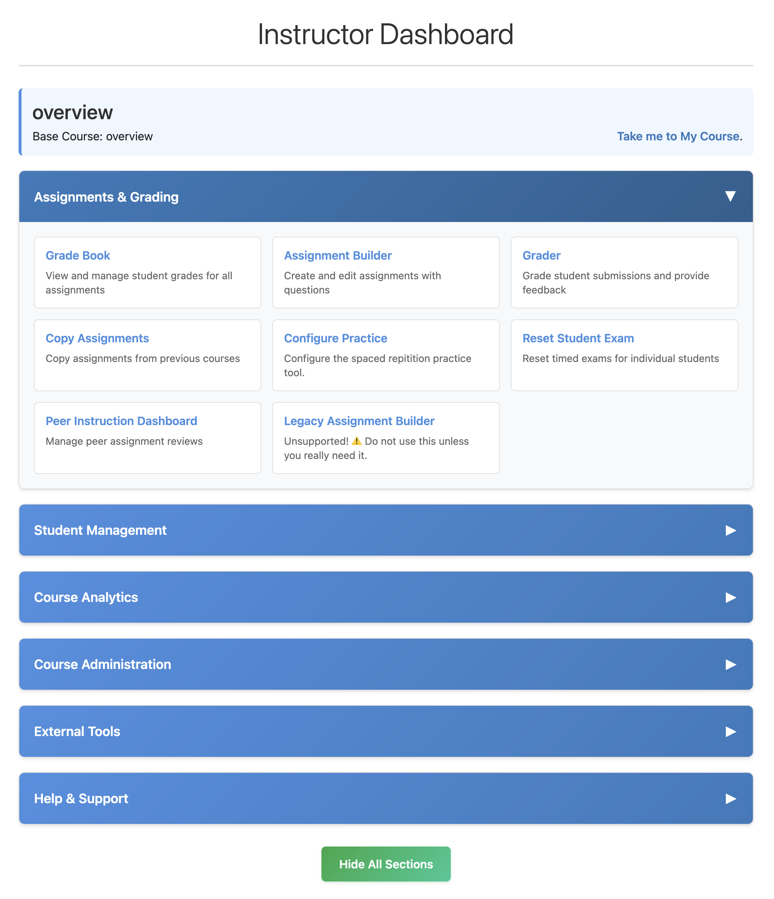

Mid-June Update
===============

Today is June 14, 2025, and we are excited to share the latest updates with you.
We have been hard at work on several projects, and we are pleased to announce that we have made significant progress on the following:

* **LTI 1.3**: We launched LTI 1.3 today. This will allow Runestone to be integrated into many more LMSs and will make it easier for instructors to use our platform in their courses.  For now you will need to contact us in order to use this feature, but we will be rolling it out to all users over the course of the summer.
* **New Instructor Dashboard**: We have been working on a new instructor dashboard that will provide a more streamlined and user-friendly experience for instructors. This includes improved navigation, and better organization.  It also provides us with a base to continue porting and updating code that has been with us for more than a decade, and badly needs a refresh. This will become the default destination for instructors from the user menu, as we update books.  In the meantime the url is `/admin/instructor/menu`

* **Peer Instruction Interface**: We have made significant improvements to the peer instruction interface.
* **Accessibility Improvements**: We have been working steadily on improving the accessibility of our platform. This includes making sure that all of our interactive elements are keyboard accessible, and that they work well with screen readers.
* **Assignment Builder**: We have been working on a new assignment builder that will allow instructors to create assignments more easily. This includes the ability to add multiple choice questions, short answer questions, and more. This is now the default from from the new instructor dashboard.  We know there are still some rough edges, but please give it a try and let us know what you think.
* **Internal Improvements**: We have been working on a number of internal improvements to our platform, including updating our dependencies, improving our logging, and optimizing our code for better performance.

All of these updates are part of our ongoing effort to improve Runestone Academy and provide a better experience for instructors and students. We appreciate your support and feedback as we continue to work on these projects.  You can help us by trying out the new features and letting us know what you think.  Reporting bugs and issues is extremely helpful, and we appreciate your patience as we work to resolve them.

.. author:: default
.. categories:: none
.. tags:: none
.. comments::
