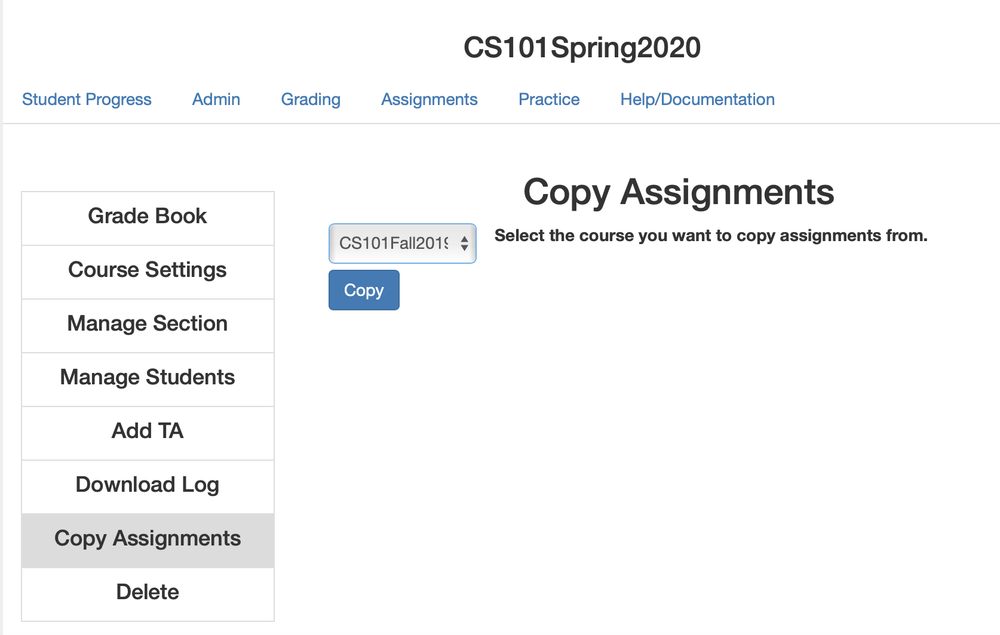

FAQ
===

Updated:  March 23, 2019

.. contents:: Frequently Asked Questions

What is Runestone Interactive?
------------------------------

Runestone is a project that has four main parts to it:

.. admonition:: Runestone Parts

   1.  A Textbook hosting service that allows you and your students to access any of the textbooks written using our tools.

   2.  A set of open source textbooks written using the tools that you are free to use and modify in your own classes.

   3.  A set of tools for writing interactive textbooks in restructuredText and other markup languages.

   4.  A open source server/API that supports the interactive textbooks

       * Save and reload source code written in the book
       * Retrieve results and answers from quizzes
       * Create "Reading Assignments" with analytics that automatically give your students points for doing the readings and getting prepared for class.
       * Grade homework problems right in the textbook
       * Create Assignments by grouping exercises

The Runestone project was originally conceived as only parts 2, and 4.  But it became clear very quickly that few people want to write their own textbooks, so part 3 was born, especially with the encouragement of our publisher at Franklin Beedle who allowed us to put our paper textbook online in interactive form.  Part 4 was conceived when it became clear that even fewer people wanted to manage their own server.

Currently number 4 is being used by over 25,000 students a day in over 600 universities, colleges, and high schools. This number is growing by around 2,000 students each semester.

Why Can't I access the Instructor Page?
---------------------------------------

How do I become an instructor?
------------------------------

* I seem to have a student account, how can I get/create an instructor account?

* I created an instructor account but...

First lets clear up a couple of misconcptions.  There is no way for me to know, just by your email address that you are an instructor.  You could be anyone.  So, there is no such thing as an instructor account.

You become an instructor by creating a course. This gives you the privileges associated with being an instructor but ONLY for that course and any other course(s) you create.  You are not an instructor for any of the open courses or anyone else's course.  There is a really nice video to help you get started in the `Instructors Guide <https://runestone.academy/runestone/static/instructorguide/index.html>`_  Please check it out as it will answer many other questions and help you make the most of Runestone.

What Runestone is Not?
----------------------

It sounds better if  you say it in your best Yoda voice.

I never wanted Runestone to be a course management system. I still don't. In my opinion there are already plenty of mediocre to good course management systems out there.  I don't want to make yet another.  However circumstances, and other instructors keep pushing Runestone in that direction.  I'm going kicking and screaming.  I would much rather integrate than reinvent.  Making online grade books is a losing proposition, as everyone has their own idea of how the "best" gradebook should work.  I brought this on myself, the moment I said "hey, self, why not make a nice little grading interface so you can grade all of the assignments right in the book?"  I thought that would be handy, and much better than downloading a bunch from moodle and running them.  They were all right there in the database, just click a button and run the program, then enter the grade.  Later the grades can be copied over to moodle or whatever.

The Rebellion continues, in the Google group I set up for instructors, I don't think I've had a single question about the content of the books.  Every single question and discussion falls under the category of "why  don't you have this <course management> feature?"  sigh.  Feature creep is real.

LTI will save me.  Its almost there, and its almost ready.  The best solution in my opinion is a good integration through LTI with Moodle, Canvas, and other LMS systems that use the standard.  I live in hope...

How do I learn more about the instructor interface
--------------------------------------------------

I have made a `very informal set of videos <https://www.youtube.com/channel/UCAfQvSLv5senKZHfaycIz8w>`_ for just this purpose.

We also have a nice new `Instructor Guide <https://runestone.academy/runestone/static/instructorguide/index.html>`_

Help!  I cannot log in.  Every time I try to log in, I have to reset my password!
---------------------------------------------------------------------------------

In 99.99% of the cases, this is because you are confusing your email address with the username you were forced to enter when you register.  So, go through the password reset process and get yourself logged in again.  Then look in the upper right hand corner of the page and pull down the user menu (the one that looks like a person.)  Your username will be displayed at the top of that menu.  We use username instead of email address to protect the privacy of our users.

I'm not getting the password reset email, can you reset my password?
--------------------------------------------------------------------

Technically, I can.  But I won't.  Runestone handles over 100 password resets a day automatically.  It can handle yours as well.  There are two things you should check.

1.  Check your SPAM folder for the password reset email. and/or add runestone to your contacts list to avoid that in the future.
2.  Talk to your IT folks and make sure they are not blocking Runestone.  We're a small group, but we did everything right with our email setup to make the military academies happy, so I think your folks ought to be happy too.

How do I add students to my course?
-----------------------------------

You invite them, either in class or with an email.  Tell them to register at runestone.academy and then give them the name of the course you created.  During the registration process they type in the name you used, and they are registered.  I usually just do this the first day of class to make sure everyone gets registered and then give them a little tour of the book and all of the things they can do.

In the future, we may look into importing a class from some LMS system like Moodle and others.

Where do I find answers to all the homework questions?
------------------------------------------------------

In my years of teaching computer science I was always learning something new and trying to stay ahead of the students.  I understand that for many of you this might be a first time teaching a CS course, and that for many you are overworked and underpaid.  I hear you, and I feel your pain.

But just as I tell my students, you can't really learn this stuff just by reading the answer, you have to do it.

We have many books on Runestone Academy written by many authors.  Whether or not authors provide an instructor guide or answers to all the questions is up to them.  So there is no blanket answer to the question.

For myself there are several reasons:

1.  Writing an instructor guide that contains all of the answers to the questions essentially doubles the work of writing a book, and even more so maintaining the book.  In all the textbooks I've used over the years for CS I've only ever had one that had a solution guide and that was largely for all of the math in a networking text.

2.  For 99% of the questions there is no one right answer.  Very likely if I give you an answer there is a better one out there, and I really don't want to get into arguments about what is better.  Especially since a lot of it comes down to style.

3.  Doing the work is the best way to prepare to teach it.  You are smarter, wiser, and a better problem solver than your students.  Its actually good for them to see how you approach solving the problem rather consulting some answer key.

4.  From a practical perspective it would be very hard for me to decide who gets the materials.  How do I know you are an instructor?  I can't possibly take the time to go check out every  user that claims to be an instructor to see if they are legit.  Right now the only benefit of being an instructor is that you get to see and grade the work of your students.  If you are a student pretending to be an instructor this gives you no advantage.

5. As I think about how best to invest the hours of my day that I have to work on this, I have very little energy or excitement for writing an answer key.  So I choose to spend my time elsewhere.  If others were to do so, and want to publish it somehow, I would be very happy to accept a PR!

6. I wold much rather put my energy into developing good unit tests, so that you know when you are right and when you are not there yet without me giving you solution.

7. With all of that, behind me, I'm still thinking about it, and trying to find a way to do it where its NOT a huge amount of extra work, and I can keep things in sync.  I've thought about charging for the instructor guide as one way to both disuade casual cheaters and to help fund Runestone development.  Stay tuned...

How Do I rebuild my book?  What happened to the rebuild button?
---------------------------------------------------------------

If you are still using a book that is under /runestone/static/... You should email me, so we can convert your course to the new way of doing things.  As runestone grew, supporting books where instructors may or may not have rebuilt with the latest bug fixes was a nightmare.  So now we take care of all of that. Everyone sees the latest version the book their course is based on!  I do updates to all the books with fixes to typos or outright bugs once a week on Saturday as our analytics show that is our least busy day.  There are lots of great things we can do with this new model.  So look for more cool features.

When I play a video I don't get any sound
-----------------------------------------

As of August 2019 this should be a non-issue.
We are in the process of moving all videos to be hosted on Youtube. In the meantime this is largely limited to Firefox, so as a workaround you can get the sound in a different browser.

Can I build my own course and host it here?
-------------------------------------------

Yes, we are currently hosting many courses for many different institutions around the world.  In fact in 2013 one large institution had 800 students using one of the books.

The best approach is to use our system to build your own textbook.  This gives you several advantages as an instructor including:

* a simple grading interface for homework problems at the end of each chapter
* some simple reports on your students activities within the textbook.
* at a glance information about the multiple choice and fill in the blank questions embedded in the text.

How do I build my own course?
-----------------------------

.. admonition::  Steps to Build

   1.  First you should register yourself as a user on this site.  When you register you must pick a course.  Just use thinkcspy or pythonds, it doesn't matter as that will change when you build your own.
   2.  Then go to the `instructors page <https://runestone.academy/runestone/admin/index>`_.
   3.  On this page you will see the links for listing and grading assignments and lots of other things.  Right now those won't show you anything, so move along to the `Create a Custom Course <https://runestone.academy/runestone/designer>`_ link.
   4. Fill in the Project Name.  This should be a short one word description of your course like `luther150a.`  When your students register for the course this is the name they will have to type in to join your particular course.   No Spaces allwed in this name.
   5. The description can say a bit more about the course.
   6. Choose one of the ready-made books for your course.
   7.  Its probably just fine to leave this at today's date.  If you set it into the future and then do some experimenting with assignments and quizzes today you won't be able to see your results because you are only shown things that come after the start date.

Is this site reliable enough to use in class?
---------------------------------------------

Yes. We host this on a very reliable service and we monitor our traffic constantly. We use a content distribution network for increased scalability and reliability.  In the Spring of 2019 we were serving over 25,000 students a day with no downtime.

Why did you change domain names?
--------------------------------

The old domain name, "interactivepython.org" was becoming quite inacurate. Although we started with Python we have a lot of users that are using the AP CS Review book (Java) and my Java for Python programmers book.  There is also at least one statistics textbook written in runestone as well.  I saw the domain name "runestone.academy" and thought that would be cool.

I want to reuse my course from last year, what should I do?
-----------------------------------------------------------

You should create a new course and then from the instructor page in the new course copy the assignments from your old course.  The assignment dates will be adjusted based on the class start date.

The instructor interface allows you to copy all your assignments from a past course into your current course, so re-using an old assignment is pretty simple.  It even re-calculates a due date for your based on the delta between your old term start date and when you had the assignment due that term.

How do I update my course to get the latest bug fixes?
------------------------------------------------------

Nothing.  Bug fixes are automatically deployed weekly.

I was just experimenting and I want to delete my course
-------------------------------------------------------

Once you are done experimenting please delete your course from the instructors interface.  If this does not happen I may have to invent a way to go back and remove courses that were clearly created as an experiment but never really used by students.

What if I want to add a new section or chapter?
-----------------------------------------------

That would be awesome.  This whole book is open source.  You can grab a copy of the source on `github <https://github.com/RunestoneInteractive>`_.  The source for thinkcspy and pythonds is in the source folder and there is a subfolder for each chapter.  If you want to make a whole new chapter then create a folder and follow the conventions of one of the other chapters.  There is full documentation for the markup language at `docs.runestoneinteractive.org <http://docs.runestoneinteractive.org>`_.  When you are finished make a pull request and we'll review your material and incorporate them into the book.

What if I want to add my own exercises?
---------------------------------------

You can add your own custom exercises by editing the assignments.rst file.  This file is meant for the descriptive or question text for a programming exercise.  Adding an exercise to this file does not automatically add it to the grading interface for your course, you still need to do that from the instructors interface.  See this `blog post <http://reputablejournal.com/Organizing-your-Runestone-Course.html>`_ for more information.

New exercises are always welcome and we would love to expand the number of exercises.  The simplest way is to go to the `github issues <http://github.com/bnmnetp/runestone/issues>`_ page and file a new issue.  In the description simply include the text for the exercise and which chapter you think it should go in.  We'll take it from there.  After we've added the exercise you can rebuild your book and it will be there.

What version of Python does your book use?
------------------------------------------

Ok, this is a question that has the potential to start nasty religious wars.  The technical answer is that this book uses a version of Python called `Skulpt <http://skulpt.org>`_.  It is entirely written in Javascript so that it runs right in the browser.  We think this is very cool.  Now some people get all crazy about whether they should teach Python 3 or Python 2.  The truth is that for CS1 and CS2 it really does not matter.  Skulpt can do print with or without parenthesis, and / can do true division or integer division and lets face it for CS1 that is really all that matters.   Sure, there are differences, but are you really going to start out by teaching your students about `dict_keys` and how they are different from a `list`.  If so, I think you are cruel and you should teach your students APL.  If you want to slant your teaching toward Python 3, you can do that with this book.  If you want to lean towards 2, you can do that too.  When you build your course there is a configuration parameter that lets you choose Python3, this forces you to use parenthesis when you print, and it makes python / default to true division, and // to integer division.

I think there is a bug in your book what should I do?
-----------------------------------------------------

Please let us know!  You can file bug reports on our `github issues page <http://github.com/RunestoneInteractive/RunestoneComponents/issues>`_.  Thanks!  If you don't have a github account then you can tweet me at iRunestone   or visit our `google.groups discussion <https://groups.google.com/forum/#!forum/runestoneinteractive>`_

I have a question that is not covered here!
-------------------------------------------
 
.. admonition::  Contact

   1.  Tweet me @iRunestone
   2.  Post the question on our google group
   3.  Send me a private email.  runestoneinteractive@gmail.com

